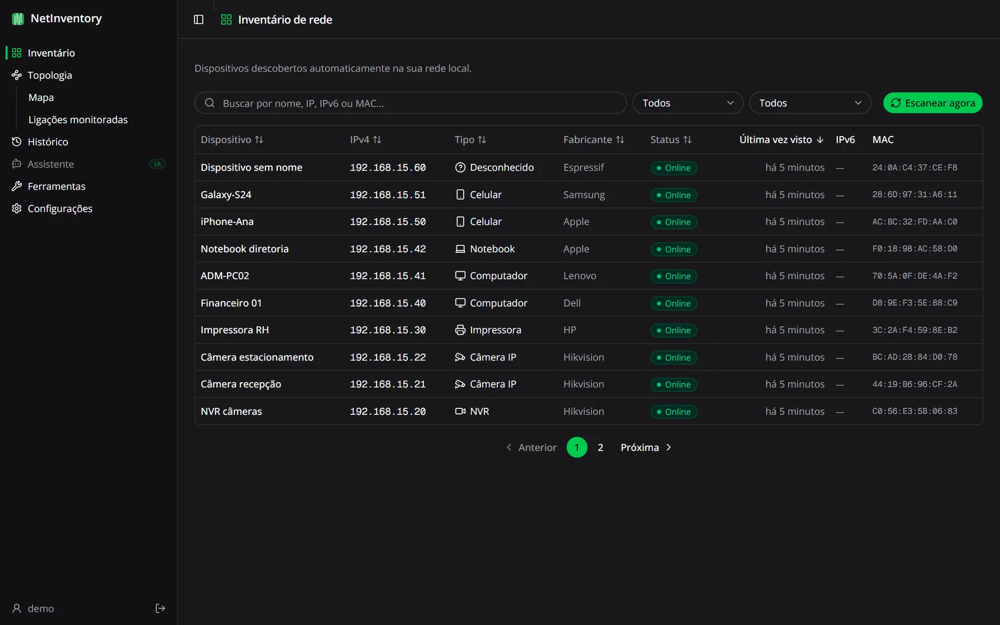
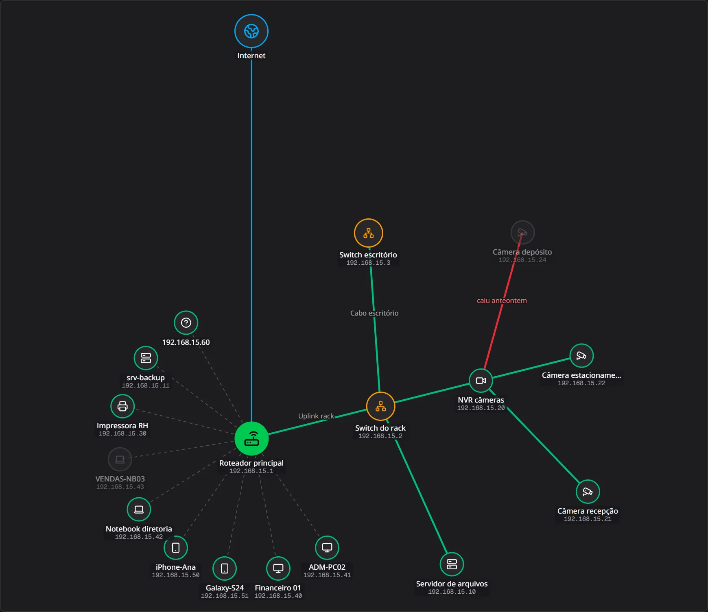
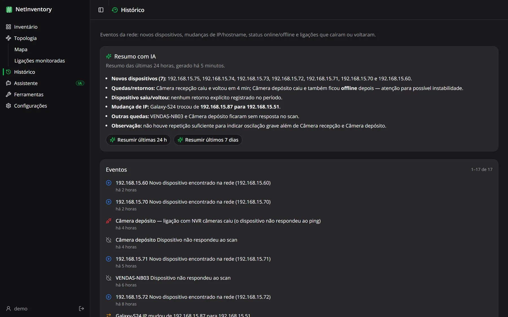
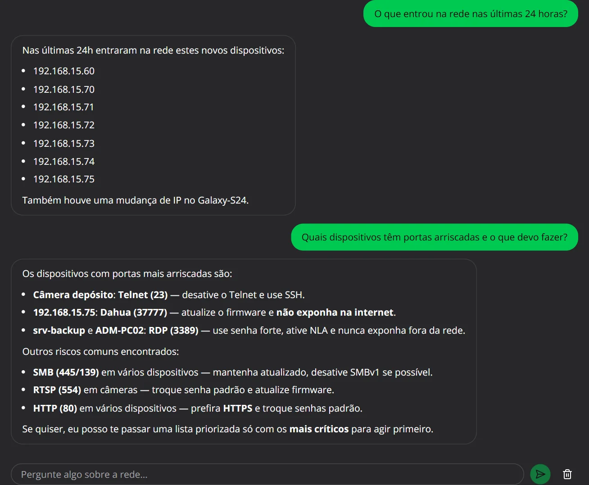

<p align="center">
  
</p>

<h1 align="center">NetInventory</h1>

<p align="center">
  <strong>Inventário, mapa e monitoramento da rede local — com um assistente de IA que entende a sua rede.</strong><br>
  Gratuito, em português e instalado em 1 minuto no Windows.
</p>

<p align="center">
  <a href="https://github.com/douglaspiero/net-inventory-ia/releases/latest"></a>
  
  
  <a href="LICENSE"></a>
</p>

<p align="center"><em>Local network inventory, topology map and link monitoring with an AI assistant — free and open source.</em></p>



## O que ele faz

O NetInventory roda em um computador da sua rede e mostra, num painel web acessível de qualquer navegador da rede:

- **Inventário automático** — scans agendados descobrem cada dispositivo com IPv4, IPv6, MAC, fabricante, hostname e portas abertas, e classificam o tipo (computador, celular, câmera, impressora, roteador…).
- **Mapa da topologia** — a rede desenhada a partir do gateway, com descoberta de ligações reais via SNMP e posições que você arrasta e ficam salvas.
- **Ligações monitoradas** — cada link importante é testado a cada 30 segundos; caiu, fica vermelho no mapa e vai para o histórico.
- **Histórico e alertas** — dispositivos novos, mudanças de IP e hostname, quedas e retornos, com notificações no navegador.
- **Ferramentas de rede** — ARP scan, port scan, SNMP, Wake-on-LAN, DHCP, DNS, tabela ARP, rotas e auditoria de segurança.
- **Usuários e perfis** — Administrador, Operador e Visualizador, cada pessoa com o acesso certo.

| Topologia | Histórico com resumo da IA |
|---|---|
|  |  |

## A IA trabalhando na administração da rede

Com a sua chave da OpenAI (opcional), o NetInventory ganha um analista de rede:

- **Assistente em português** — "o que entrou na rede nas últimas 24 horas?", "quais dispositivos têm portas arriscadas?". Ele consulta inventário, histórico e ligações antes de responder.
- **Identificação de dispositivos** — sugere nome e tipo para aparelhos desconhecidos a partir de fabricante, portas e tipo de MAC, com o nível de confiança.
- **Diagnóstico de segurança** — transforma as portas de risco da rede inteira num relatório priorizado com as ações a tomar.
- **Resumo de eventos** — as últimas 24 horas ou 7 dias em poucas linhas.

| Assistente | Identificação com IA |
|---|---|
|  |  |

**Privacidade:** IPs, MACs, hostnames e apelidos são substituídos por marcadores (`ip-1`, `dispositivo-1`…) **antes** de qualquer envio e restaurados na resposta ([`src/lib/ai/redact.ts`](src/lib/ai/redact.ts)). As chamadas só acontecem quando você clica, usam `store: false` e ficam em cache por 24 h. A chave fica criptografada (AES-256-GCM) no banco e nunca volta ao navegador.

## Instalação (Windows)

1. Baixe o instalador em **[Releases](https://github.com/douglaspiero/net-inventory-ia/releases/latest)** e confira o SHA-256 publicado.
2. Execute num computador que fique ligado e esteja na rede que será monitorada. Sem assinatura digital, o Windows mostra o aviso do SmartScreen: **Mais informações → Executar assim mesmo**.
3. Abra `http://localhost:3000` (ou `http://IP-do-computador:3000` de outra máquina) e crie o administrador.
4. Em **Configurações → Scan da rede**, informe a faixa da sua rede — descubra com `ipconfig`: IPv4 `192.168.0.25` e máscara `255.255.255.0` → `192.168.0.0/24`.
5. Opcional: cadastre a sua chave da OpenAI quando o app pedir (ou em Configurações).

O instalador traz tudo embutido (Node.js, banco SQLite, migrações), registra o serviço **NetInventory** (inicia com o Windows e reinicia sozinho) e libera a porta 3000 no firewall para redes privadas. Os dados ficam em `C:\ProgramData\NetInventory` e são mantidos em atualizações.

## Perfis de acesso

| | Administrador | Operador | Visualizador |
|---|:-:|:-:|:-:|
| Ver inventário, mapa, ligações e histórico | ✓ | ✓ | ✓ |
| Rodar scan, ferramentas e testar ligações | ✓ | ✓ | |
| Editar dispositivos, ligações e o mapa | ✓ | ✓ | |
| Usar os recursos de IA | ✓ | ✓ | |
| Configurações (scan, chave da IA, limpeza) | ✓ | | |
| Gerenciar usuários | ✓ | | |

As permissões são checadas no servidor em cada ação ([`src/lib/auth/permissions.ts`](src/lib/auth/permissions.ts)). Desativar um usuário ou redefinir a senha dele encerra as sessões abertas na hora, e o sistema nunca fica sem um administrador ativo.

## Desenvolvimento

Requisitos: Node.js 22 ou mais novo (testado no 24), Windows (os scans usam `ping`, `arp` e `nbtstat` do sistema; partes funcionam em Linux).

```bash
npm install
cp .env.example .env          # preencha AUTH_SECRET (o comando para gerar está no arquivo)
npx prisma migrate dev        # cria o banco SQLite local (prisma/dev.db)
npm run dev                   # http://localhost:3000
```

```bash
npm test                      # testes (Vitest)
npm run lint                  # ESLint
npm run build:installer       # gera installer/output/NetInventory-Setup-<versão>.exe
npm run site                  # serve o site de apresentação (pasta site/) em http://localhost:8080
```

O `build:installer` faz o build *standalone* do Next numa pasta separada (`.next-installer`, sem conflitar com o `next dev`), embute o `node.exe` (com hash conferido) e o [WinSW](https://github.com/winsw/winsw) para o serviço, e compila com o [Inno Setup 6](https://jrsoftware.org/isinfo.php) (`winget install JRSoftware.InnoSetup`).

### Stack

- **Next.js 15** (App Router, Server Actions), **React 19**, **TypeScript**, **Tailwind CSS v4**, shadcn/ui, TanStack Query
- **Prisma** + **SQLite**
- **OpenAI Responses API** com Structured Outputs e function calling
- Instalador: build standalone + Node embutido + WinSW + Inno Setup; migrações aplicadas na inicialização com `node:sqlite` ([`installer/runtime/launcher.cjs`](installer/runtime/launcher.cjs)), compatíveis com a tabela do Prisma

### Como funciona a descoberta de rede

Módulo em `src/lib/network/`:

1. **`subnet.ts`** — expande o CIDR configurado na lista de IPs (limite de 4096 endereços por scan).
2. **`ping.ts`** — ping sweep concorrente para descobrir hosts ativos.
3. **`arp.ts`** — lê a tabela ARP do sistema para obter os MACs.
4. **`dns.ts`** — hostname por DNS reverso e, no Windows, NetBIOS (`nbtstat`).
5. **`oui-data.ts`** + **`vendor-lookup.ts`** — fabricante pelo MAC: tabela local primeiro e, se faltar, a API gratuita [macvendors.com](https://macvendors.com) (uma requisição por vez, com cache).
6. **`port-scan.ts`** — portas TCP comuns (22, 80, 443, 445, 3389, 631, 9100…).
7. **`classify.ts`** — heurística de tipo a partir de fabricante, hostname e portas.

O resultado é persistido por `src/lib/scan-service.ts`, que compara com o estado anterior e registra em `DeviceEvent` cada novo dispositivo, mudança de IP/hostname ou transição online/offline.

## Limitações conhecidas

- Só Windows no instalador; o painel é servido em HTTP na rede local (não exponha a porta 3000 para a internet).
- Alertas apenas no navegador (ainda sem e-mail, Telegram ou WhatsApp) e sem exportação do inventário.
- Sistema operacional e usuário logado não são detectados (exigiriam agente ou credenciais).
- A classificação de tipo é heurística; a topologia sem SNMP mostra ligações presumidas ao gateway.

Sugestões e contribuições são bem-vindas — abra uma [issue](https://github.com/douglaspiero/net-inventory-ia/issues). Para falhas de segurança, veja o [SECURITY.md](SECURITY.md).

## Licença e autor

[MIT](LICENSE) © 2026 **[Douglas Piero](https://www.linkedin.com/in/douglaspiero/)** — criador e desenvolvedor do NetInventory.
